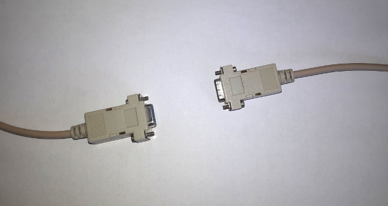
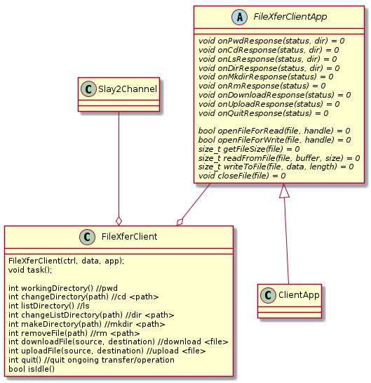
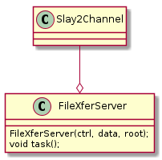

# file_xfer
A *FTP* like file transfer protocol using a serial connection (based on [slay2](https://github.com/minlux/slay2)). It implements a client and a server that can be used as a foundation for different user specific file transfer applications between (heterogen) systems like (window <-> linux, embedded <-> rasberry pi, x <-> y).



Like *FTP* *file_xfer* is using two communication channels to handle its functionality:
- Control channel: Intended to send the command requests (from client to server), and to receive the servers acknowledgment.
- data channel: Used to do the actual data (file and directory listing) transfer.

Note: A channel can be considered as a serial point to point connection. *Slay2* implements up to 256 logical communication channels over one single serial *RS232* connection. For *file_xfer* we are using two such channels. As in general *commands* has higher priority than *data transfer* the control channel shall has higher (or at least the same) priority than the data channel. When using *Slay2* this is fulfilled by using a **lower** channel number the control channel and a **higher** channel number for the data channel.


## Architecture

### Client
Software architecture of an *file_xfer* client is shown below. `FileXferClient` is using two `Slay2Channel`s as control and data channel for for communiction. To interface with the hostes file system it is using an instance of `FileXferClientApp`. Therefore the application has to implement the pure virtual interface given by class `FileXferClientApp`.

A client application is then just using the API functions of `FileXferClient` to invoke the desired operation, like browsing the servers file system (`changeDirectory()`, `listDirecotry()`, `makeDirectory()`, ...) or up- and downloading files to/from server (`uploadFile()`, `downloadFile()`).



To "drive" the communication and to handle the response from the server, the application has to call `task()` cyclically. \
Note: The *FileXferClientApp::functions* like `onLsResponse()` etc are executed in context of `task()`!


### Server
The public interface and the efford needed to setup a *file_xfer* client is much or easier. It requiers also two `Slay2Channel`s as control and data channel.
User can specifiy the directory used as the servers *root*. The the application must only call `task()` cyclically to "drive" the communication and to handle the incomming requests (and the file up-/download).




## Commands
The following commands are implemented

| Command | Argument       | Description                           |
|---------|----------------|---------------------------------------|
| W       | -              | Print working directory               |
| C       | *path*         | Change directory                      |
| L       | -              | List directory                        |
| D       | *path*         | Change directory and list it          |
| M       | *path*         | Make directory                        |
| R       | *path*         | Remove directory or file              |
| U       | *name*,*size*  | Upload file (from client to server)   |
| D       | *name*         | Download file (from server to client) |
| Q       | -              | Quit/Cancel an ongoing transfer       |


| Status  | Description                           |
|---------|---------------------------------------|
| a       | Acknowledge                           |
| n       | Negative-Acknowledge                  |


## Protocol
Client is using the *control channel* to request commands to the server. A *command* is given by **ONE** capital letter, followed by optional arguments (like *path*, *filename*, etc.). If present, arguments are zero terminated. \
The server responds to a command with an **acknowledge** (a) or a **negative-acknowledge** (n). Depending on the command, there may be additional (zero-terminated) payload data following to an **acknowledge** (e.g. the "working directory" or the server requested with an "pwd" or and "cd" command).

It depends on the command, if a data transfer on the *data channel* is initiated. A *list directory* command for example, will receive the "directory listing" on the *data channel* ("down" from the server to the client). An *upload file* command will lead the client to send the file data "up" to the server (using the *data channel*).

Summarized (from clients point of view):
- Clients sends **commands** via *control channel* (`Request`)
- Client receives **acknowledge** (a) or **negative-acknowledge** (n) on *control channel* (`Response`)
- Client **uploads** files to the server using the *data channel* (`Up`)
- Client **downloads** files from the server using the *data channel* (`Down`)
- Client receives a directory listing the server using the *data channel* (`Down`)

| Command                    | Request           | Response         | Up               | Down                   |
|----------------------------|-------------------|------------------| -----------------| -----------------------|
| Print working directory    | W                 | a*dir*\0         |      -           |         -              |
| Change directory           | C*path*           | a*dir*\0         |      -           |         -              |
| List directory             | L                 | a                |      -           |    *listing*\0         |
| Change and list directory  | I*path*           | a*dir*\0         |      -           |    *listing*\0         |
| Make directory             | M*path*           | a                |      -           |         -              |
| Remove dir/file            | R*path*           | a                |      -           |         -              |
| Upload file                | U*name*,*size*\0  | a                |   *binary-data*  |    a *on completion*   |
| Download file              | D*name*           | a*size*\0        |      -           |    *binary-data*       |
| Quit/Canel operation       | Q                 | a                |      -           |         -              |


Note: The size, in *upload file* and *download file* command is given in "decimal ascii format".
Note: Path can be relative to the *current working directory* or (if prefixed with a leeding `/`) absolute to the servers *root directory*.
Note: See appendix for information regarding the *directory listing*


## Demo
This project comes with a demo application of a *dummy* client + server. In this demo, both participants are running on the same linux machine, using the linux tool *socat* (which create two interconnected serial devices, */dev/pts/1* and */dev/pts/2*) to connect client and server together.

```
+---------------+
| Linux Machine |
+---------------+----------------------------------------------------------------------+
|                                                                                      |
|                                                                                      |
|    +------------------+                                     +------------------+     |
|    |                  |                                     |                  |     |
|    |                  | /dev/pts/1  +----------+            |                  |     |
|    |      Client      +-------------+  Linux   | /dev/pts/2 |      Server      |     |
|    |                  |             |   socat  +------------+                  |     |
|    |                  |             +----------+            |                  |     |
|    +------------------+                                     +------------------+     |
|                                                                                      |
|                                                                                      |
+--------------------------------------------------------------------------------------+
```

### Build
The demo can be build using cmake:
```
cd build
cmake ..
make
```

### Run
First, run the *socat* command to create two interconnected serial devices:
```
socat -d -d pty,raw,echo=0 pty,raw,echo=0
```

The server can be started (in the build folder).
```
./fx_server /dev/pts/2
```

The client can be started (in the build folder):
```
./fx_client /dev/pts/1
```


Now in the client you can enter some commands like:
- `W` + *Enter* to get the "current working directory" of the server
- `L` + *Enter* to get a *direcotry listing* of servers "current working directory"
- `Cmanuel` + *Enter* to "cd" into direcotry *manuel*
- `IDownloads` + *Enter* to "cd" into direcotry *Downloads* and request listing of that directory (in one command)
- `Dpicture.jpg` + *Enter* to download the file "picture.jpg" from the server to the client.


### Issues
There seems to be an issue when using the demo with *socat* (exactly as described in this paragraph). *socat* introduces a delay that leads to transmission timeouts in *slay2*. Thus it would be better to make a try of this software on two dedicated machines interconnected using a "real" serial connection (aka a Nullmodem-Cable).


## Appendix, Directory Listing
A directory listing looks like that:
```
.,/manuel/Downloads/,,
f,xubuntu-19.04-desktop-amd64.iso,1590722560,2019-04-24 10:54:57
f,code_1.43.2-1585036376_amd64.deb,62307578,2020-04-05 09:56:24
d,phpLiteAdmin_v1-9-7-1,,
d,DCIM,,
```

It follows the following format:
```
<type>,<name>,<size>,<date>\n    <-- 1st line contains the current directory (type = '.')
<type>,<name>,<size>,<date>\n    <-- the other lines, are either files (f) or directories (d)
...
<type>,<name>,<size>,<date>\n
\0                               <-- end of list
```

- files/directories are separated by '\n'.
- list ends with '\0'
- a file/directory entry is given by 4 values, separated by ','

**type**
- '.'  the current directory
- 'd'  a directory entry
- 'f'  a file entry

**name**
- the file or directory name
- in case of current directory (type = '.'), the (full path of) current directory

**size**
- size of file, in bytes
- decimal ascii
- empty, for "non-file-types"

**date**
- last modification date of file. format: "YYYY-mm-dd HH:MM:SS"
- empty, for "non-file-types"


